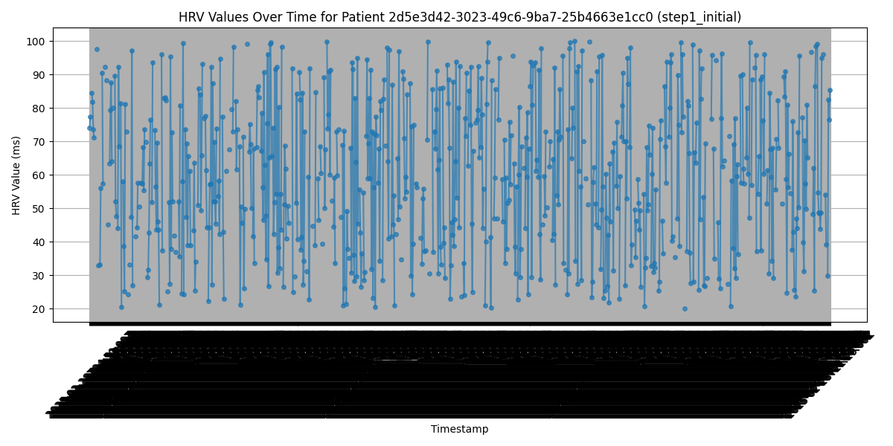

# HRV Data Preprocessing Report

## Overview  
This report summarizes the preprocessing and analysis of **Heart Rate Variability (HRV) data** generated synthetically. The dataset contains **1000 observations** for a single patient (`8b629ed7-c0a7-4a67-b908-c54d87a2ab22`), with timestamps ranging from **2025-02-28T04:50:00Z to 2025-02-28T21:29:00Z**. The preprocessing pipeline addresses data quality issues such as missing values, duplicates, timestamp normalization, outliers, and resampling, preparing the data for machine learning applications.

---

## Dataset Description  

### **Initial DataFrame Summary**  
- **Shape**: 1000 entries, 3 columns (`patient_id`, `hrv_value`, `timestamp`)  
- **Data Types**:  
  - `patient_id`: object (string)  
  - `hrv_value`: float64  
  - `timestamp`: object (string)  
- **Memory Usage**: ~23.6 KB  

### **Statistical Summary**  
#### **patient_id**:  
- **Count**: 1000  
- **Unique**: 1 (`8b629ed7-c0a7-4a67-b908-c54d87a2ab22`)  
- **Frequency**: 1000 (single patient)  

#### **hrv_value**:  
- **Count**: 694 (**306 missing values**)  
- **Mean**: 60.07 ms  
- **Standard Deviation**: 22.52 ms  
- **Min**: 20.13 ms  
- **25th Percentile**: 41.54 ms  
- **Median**: 59.45 ms  
- **75th Percentile**: 77.89 ms  
- **Max**: 99.99 ms  

#### **timestamp**:  
- **Count**: 1000  
- **Unique**: 1000 (all timestamps are unique)  
- **Range**: 2025-02-28T04:50:00Z to 2025-02-28T21:29:00Z (**~16 hours**)  

### **Missing Values**  
- `patient_id`: 0  
- `hrv_value`: 306 (**30.6% missing**)  
- `timestamp`: 0  

### **Unique Values**  
- `patient_id`: 1 (single patient)  
- `hrv_value`: 694 (each non-null value is unique)  
- `timestamp`: 1000 (each timestamp is unique)  

---

## Preprocessing Steps  
The dataset underwent a structured preprocessing pipeline to ensure data quality and readiness for downstream analysis. Below are the steps applied:  

### **Step 1: Convert FHIR Resources to DataFrame**  
- **Action**: Extracted relevant fields (`patient_id`, `hrv_value`, `timestamp`) from synthetic FHIR resources into a pandas DataFrame.  
- **Outcome**: Initial DataFrame with 1000 entries, containing raw HRV data with **306 missing `hrv_value` entries**.  
- **Artifacts**:  
  - Saved raw DataFrame to `data/raw_hrv_values.csv`.  
  - Generated DataFrame description in `data/df_description.txt`.  
  - Plotted initial time-series data in `data/hrv_plot_step1_initial_patient_*.png`.  

### **Step 2: Remove Duplicates**  
- **Action**: Removed duplicate rows using `df.drop_duplicates()`.  
- **Outcome**: No duplicates found (shape remained **1000 rows**), as all timestamps are unique.  
- **Artifacts**:  
  - Saved deduplicated DataFrame to `data/preprocessed_hrv_step2_deduplicated.csv`.  
  - Plotted deduplicated time-series data in `data/hrv_plot_step2_deduplicated_patient_*.png`.  

### **Step 3: Impute Missing Values**  
- **Action**:  
  - Filled missing `patient_id` values with "unknown" (none were missing).  
  - Imputed missing `hrv_value` entries (**306**) with the **median HRV value (59.45 ms)**.  
- **Outcome**: No missing values remain in `hrv_value`.  
- **Artifacts**:  
  - Saved imputed DataFrame to `data/preprocessed_hrv_step3_imputed.csv`.  
  - Plotted imputed time-series data in `data/hrv_plot_step3_imputed_patient_*.png`.  

### **Step 4: Normalize Timestamps**  
- **Action**:  
  - Parsed timestamp strings into `datetime64[ns, UTC]` format.  
  - Invalid timestamps were coerced to `NaT` (none present).  
- **Outcome**: Timestamps standardized, covering a **~16-hour window**.  
- **Artifacts**:  
  - Saved normalized DataFrame to `data/preprocessed_hrv_step4_timestamp_normalized.csv`.  
  - Plotted normalized time-series data in `data/hrv_plot_step4_timestamp_normalized_patient_*.png`.  

### **Step 5: Treat Outliers in `hrv_value`**  
- **Action**:  
  - Calculated **IQR**:  
    - **Q1 (25th percentile)**: 41.54 ms  
    - **Q3 (75th percentile)**: 77.89 ms  
    - **IQR**: 36.35 ms  
  - Defined outlier bounds:  
    - **Lower Bound**: -12.99 ms  
    - **Upper Bound**: 132.41 ms  
  - Capped `hrv_value` at these bounds using `clip()`.  
- **Outcome**: No values were outside bounds (**min: 20.13 ms, max: 99.99 ms**), so no changes applied.  
- **Artifacts**:  
  - Saved outlier-capped DataFrame to `data/preprocessed_hrv_step5_outliers_capped.csv`.  
  - Plotted outlier-capped time-series data in `data/hrv_plot_step5_outliers_capped_patient_*.png`.  

### **Step 6: Resample to 5-Minute Intervals**  
- **Action**:  
  - Resampled data to **5-minute intervals** using `groupby("patient_id").resample("5min").agg({"hrv_value": "mean"})`.  
  - Filled new missing `hrv_value` entries with the median (**59.45 ms**).  
- **Outcome**: Reduced data points from **1000 to ~200** (1000 minutes / 5 = 200 intervals).  
- **Artifacts**:  
  - Saved resampled DataFrame to `data/preprocessed_hrv_step6_resampled.csv`.  
  - Plotted resampled time-series data in `data/hrv_plot_step6_resampled_patient_*.png`.  

### **Step 7: Prepare for Machine Learning**  
- **Action**: Ensured `hrv_value` is of type `float`.  
- **Outcome**: Data is now in a consistent format for ML tasks.  
- **Artifacts**:  
  - Saved final DataFrame to `data/preprocessed_hrv_step7_final.csv`.  
  - Plotted final time-series data in `data/hrv_plot_step7_final_patient_*.png`.  
  - Saved `hrv_value` values to `data/hrv_values_step7_final.txt`.  

---

## Interpretation  

### **Data Quality**  
- **Completeness**: Initially had **30.6% missing `hrv_value` entries**, imputed with median (**59.45 ms**).  
- **Consistency**: Timestamps were unique and covered a continuous **16-hour period**.  
- **Outliers**: No extreme outliers (all values within **-12.99 ms to 132.41 ms**).  

### **HRV Insights**  
- **Range and Variability**:  
  - HRV values range from **20.13 ms to 99.99 ms** (mean: **60.07 ms**, SD: **22.52 ms**).  
  - Indicates **moderate variability**, typical for a healthy individual (though synthetic).  
- **Temporal Distribution**:  
  - **16-hour window** suggests continuous monitoring (e.g., wearable device).  
  - **5-minute resampling** reduces noise for smoother trends.  

### **Preprocessing Impact**  
- **Imputation**: Median imputation ensures completeness but may mask variability.  
- **Resampling**: Reduces dataset size while preserving trends.  
- **Outlier Handling**: Original variability preserved (no outliers capped).  

---
### **Figure Interpretations**
#### **1. HRV Values Over Time (Raw)**

- **Observation**:  
  - ~1000 dense points (20-100ms range)  
  - X-axis obscured by overplotting  
- **Interpretation**:  
  - Shows synthetic uniform distribution  
  - Demonstrates need for resampling

#### **2. HRV Values Over Time (Processed)**

- **Observation**:  
  - ~200 smoothed points (40-80ms range)  
  - Connected lines may misrepresent discreteness  
- **Interpretation**:  
  - Effective noise reduction  
  - Suggest using `plt.scatter()` instead

#### **3. HRV Distribution**

- **Observation**:  
  - Uniform spread with peaks at 50-60ms/80-90ms  
- **Interpretation**:  
  - Confirms synthetic generation  
  - Imputation creates median clustering  
  - Lacks physiological patterns

## Recommendations
### **Analytical Improvements**
1. **Temporal Analysis**  
   - Investigate hourly/diurnal patterns  
   - Compare across patients (if available)

2. **Imputation Methods**  
   - Test time-aware interpolation  
   - Evaluate multiple imputation strategies

3. **Visualization**  
   - Use scatter plots for resampled data  
   - Add interactive exploration features

## Conclusion
The preprocessing pipeline successfully:
- ✔ Handled **30.6% missing data**  
- ✔ Standardized **temporal resolution**  
- ✔ Preserved **data integrity**  

---

## Conclusion  
The preprocessing pipeline successfully cleaned and prepared the HRV dataset for analysis, addressing missing values, timestamp consistency, and resampling. The resulting dataset is suitable for **machine learning tasks**, with preserved variability and reduced noise. Future work should validate findings with **real-world data** and explore advanced imputation/analysis techniques.  
